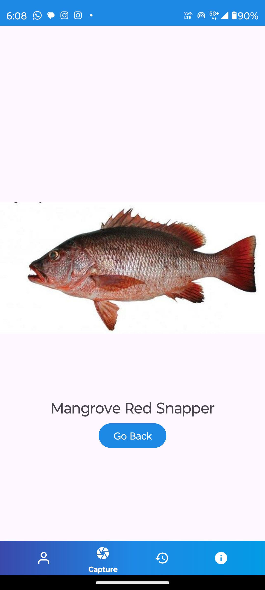
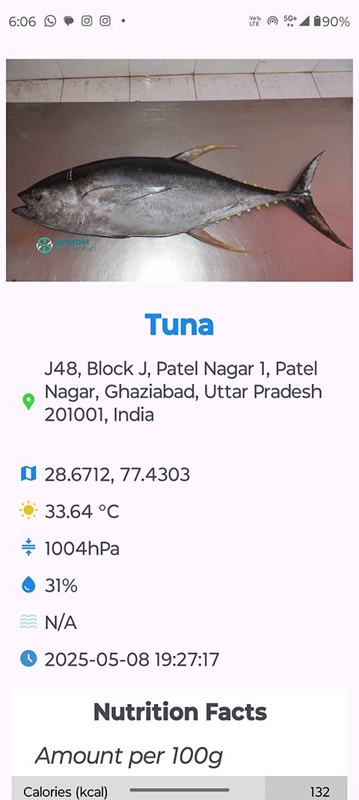
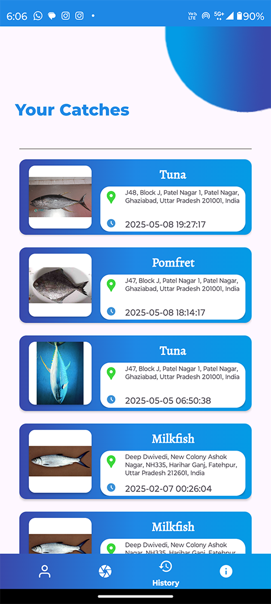

# Nemo: Intelligent Fish Species Identification & Insights

A lightweight Android application that allows fishermen and marine enthusiasts to instantly identify fish species using a machine-learning model. Simply install the APK, snap a photo of a catch, and see the predicted species — no internet required for on-device inference.

---

## 📱 App Features

- **Instant Fish Identification**  
  Uses a TensorFlow Lite–optimized MobileNetV2 model to classify fish from a single image in under 3 seconds.

- **Catch History**  
  Stores each identified fish (species, timestamp, location) so users can review their past catches.

- **Real-Time Weather Data**  
  Fetches local weather (temperature, humidity, pressure, etc.) at the time of each capture.

- **Nutritional Information**  
  Displays key nutritional facts (calories, protein, fat, etc.) for each identified species.

- **Offline Support**  
  Core classification works without any internet connection.

---

## 🚀 Quick Start

1. **Download & Install**  
   - Grab the latest `Nemo.apk` from the repository.  
   - On your Android device, enable **Install from Unknown Sources** (Settings → Security).  
   - Tap the APK to install.

2. **Run the App**  
   - Open “NEMO” from your app drawer.  
   - **Sign In / Sign Up**:  
     - Use email/password or Google Sign-In (firewall-safe OAuth).  
   - **Grant Permissions**:  
     - Allow camera, location, and storage access when prompted.

3. **Identify a Fish**  
   - From the main screen, tap **“Capture”**.  
   - Snap a clear photo of the fish or pick an existing image.  
   - The app will preprocess & run the image through the ML model.  
   - See the predicted species name and a reference image.

4. **Review Catch History**  
   - Tap **“History”** in the bottom navigation.  
   - Scroll through saved entries (species, date/time, location).  
   - Tap an entry to view weather details and nutritional info.

---

## 🛠️ Technology Stack

- **Frontend**: Kotlin + XML (Android SDK)  
- **ML Framework**: TensorFlow Lite (MobileNetV2, optimized)  
- **Backend**: Firebase Authentication (Google Sign-In) and Firestore (catch history)  
- **APIs**: OpenWeatherMap (real-time weather integration)  
- **Data Augmentation**: Albumentations (Python)  

---

## 📸 Screenshots

1. **Login / Sign-Up Screen**  
   

3. **Fish Capture & Prediction**  
   

5. **Prediction Result & Nutritional Info**  
   

7. **Catch History Overview**  
   

---

## 🔧 Installation & Usage

1. **Clone or Download** this repository:  
   ```bash
   git clone https://github.com/KIET-Github/CS-2025-C.git
   ```

2. **Navigate to the APK Location**  
   The compiled APK file is located inside the `PCS-54` folder:
   ```
   CS-2025-C/PCS-54/Nemo.apk
   ```

3. **Install the APK**  
   - Copy `Nemo.apk` to your Android device.  
   - Install it via the device’s file manager or use ADB:
     ```bash
     adb install PCS-54/Nemo.apk
     ```

4. **Launch & Enjoy**  
   - Grant necessary permissions like **camera** and **location**.  
   - Start identifying fish using real-time ML-powered classification.  
   - View species info and track your fish history.

---

## 🔗 Resources

- **Research Paper**:  
  Singh, M. et al. (2025) _Nemo: ML based fish species classification_. 2025 2nd International Conference on Computational Intelligence, Communication Technology and Networking (CICTN), pp. 461–467. doi:10.1109/cictn64563.2025.10932485.

- **Patent Documents**:  
  See the `/PCS-54/Patent/` folder for patent application materials.


---

> **Enjoy NEMO!**  
> Your pocket-friendly fish identification app powered by Machine Learning.
